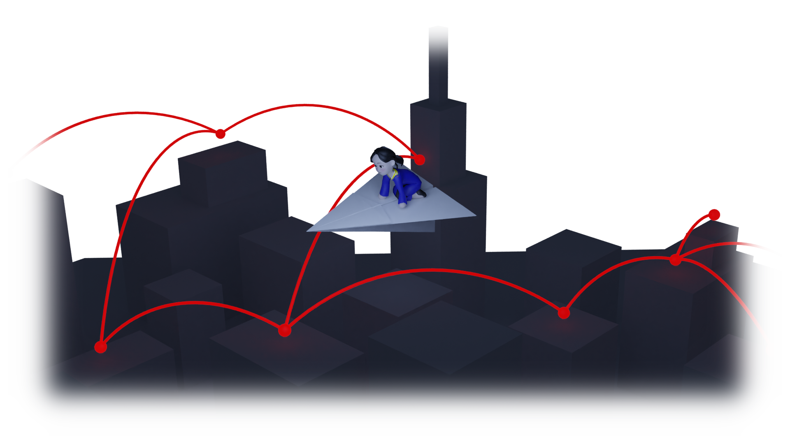

# 프로그램 배포
플랫폼별 실행/설치 파일을 배포합니다.  
1. 개발자에게 맥북이 없습니다. macOS와 iOS는 검수가 이루어지지 않아 정말로 잘 동작하는지 알 수 없습니다. 미안합니다.
2. [Google Play Store 다운로드](https://play.google.com/store/apps/details?id=org.pjcone.diyfreechat)

## v0.4a (출시 준비중)
- 전반적 구조 개선이 이루어질 예정입니다.
- 0.3.x 버전과 자료가 호환되지 않게 됩니다.
---------------------
## v0.3.1a
[Windows 다운로드](https://github.com/is2you2/DIYFreeChat_export/raw/master/release/0.3.1a/DIYFreeChat_windows.zip)  
[OS X 다운로드](https://github.com/is2you2/DIYFreeChat_export/raw/master/release/0.3.1a/DIYFreeChat_OSX.zip)  
[Linux 다운로드](https://github.com/is2you2/DIYFreeChat_export/raw/master/release/0.3.1a/DIYFreeChat_linux.zip)  
[Android APK 다운로드](https://github.com/is2you2/DIYFreeChat_export/raw/master/release/0.3.1a/DIYFreeChat.apk)  
[iOS 다운로드](https://github.com/is2you2/DIYFreeChat_export/raw/master/release/0.3.1a/DIYFreeChat_iOS.zip)
- 구글 플레이스토어 보안 정책 준수를 위한 수정 (rsa 보안키 노출 수정)

## v0.3a
- 가장 최소한의, 기본 기능이 준비되어 있습니다. (서버 생성/접속, 사람/그룹 관리, 메시지/파일 전송)
- 많은 수의 UI동작 및 버그 이슈가 있고, 개발자가 그것을 인지한 상태입니다.
- 버그 테스트가 아닌, 오직 사용 자체에 목적을 두고 우선 업로드 진행되었습니다.